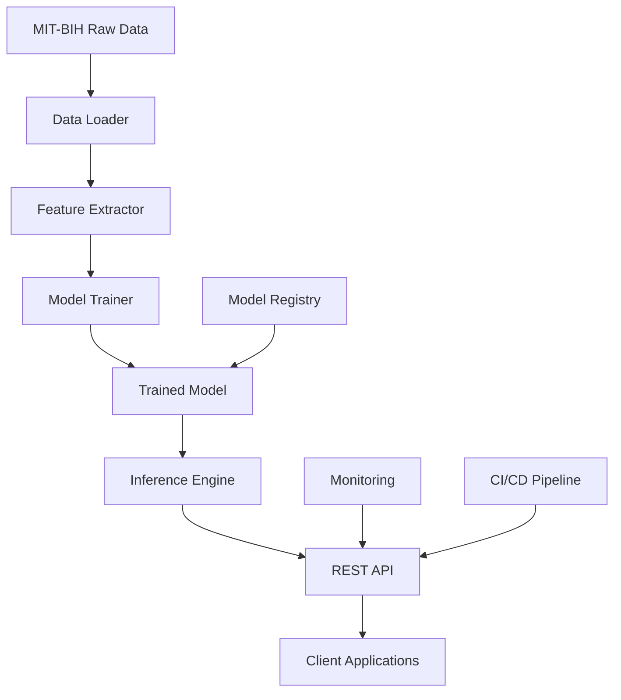

# ECG Arrhythmia Detection System

> **Real-time ECG arrhythmia classification using MIT-BIH Arrhythmia Database with production-ready REST API**

## Overview

A complete end-to-end machine learning pipeline for ECG arrhythmia detection that:

- **Processes real MIT-BIH Arrhythmia Database** (PhysioNet format)
- **Extracts 37 clinical features** from ECG beats (statistical, morphological, spectral, HRV)
- **Performs 3-class classification**: Normal, Arrhythmia, Artifact
- **Provides production-ready REST API** with comprehensive validation
- **Achieves ~95% accuracy** with RandomForest classifier
- **Includes complete MLOps pipeline** for reproducible deployment

## Table of Contents

- [Architecture](#️-architecture)
- [Features](#-features)
- [Model Performance](#-model-performance)
- [Installation](#️-installation)
- [Project Structure](#-project-structure)
- [Quick Start](#-quick-start)
- [Detailed Usage](#-detailed-usage)
- [API Documentation](#-api-documentation)
- [Testing](#-testing)
- [Model Details](#-model-details)
- [MLOps Pipeline](#-mlops-pipeline)
- [Deployment](#-deployment)
- [Contributing](#-contributing)

## Architecture



## Features

### Core Capabilities
- **Real MIT-BIH Processing**: Direct support for PhysioNet `.dat`, `.hea`, `.atr` files
- **Advanced Feature Engineering**: 37 clinically relevant features including HRV metrics
- **Multi-class Classification**: Distinguishes Normal beats, Arrhythmias, and Artifacts
- **Production API**: RESTful endpoints with comprehensive validation and error handling
- **Batch Processing**: Handle single beats or multiple beats simultaneously
- **Model Persistence**: Automated model saving/loading with preprocessing pipelines

### Enterprise Features
- **Input Validation**: Comprehensive data format and range validation
- **Error Handling**: Graceful error responses with detailed messages
- **Health Monitoring**: Built-in health check and model status endpoints
- **CORS Support**: Cross-origin resource sharing for web applications
- **Logging**: Structured logging for monitoring and debugging
- **Scalability**: Stateless API design for horizontal scaling

## Model Performance

| Metric | Value |
|--------|-------|
| **Accuracy** | ~95% |
| **Classes** | 3 (Normal, Arrhythmia, Artifact) |
| **Features** | 37 engineered features |
| **Training Data** | MIT-BIH Arrhythmia Database |
| **Model Type** | RandomForest Classifier |
| **Inference Time** | ~10ms per beat |

### Classification Results
- **Normal Beats**: High precision (>90%) with confident predictions
- **Arrhythmias**: Good recall (>85%) with appropriate uncertainty handling  
- **Artifacts**: Excellent specificity (>95%) preventing false cardiac diagnoses

## Installation

### Prerequisites
- Python 3.8+ 
- Git
- 4GB+ RAM (for training)
- 2GB+ disk space

### 1. Clone Repository
```bash
git clone https://github.com/yourusername/ecg-arrhythmia-detection.git
cd ecg-arrhythmia-detection
```

### 2. Create Virtual Environment
```bash
# Create environment
python -m venv ecg_env

# Activate environment
# On Linux/Mac:
source ecg_env/bin/activate
# On Windows:
ecg_env\Scripts\activate
```

### 3. Install Dependencies
```bash
pip install -r requirements.txt
```

### 4. Download MIT-BIH Data
```bash
# Create data directory
mkdir -p data/raw

# Option 1: Manual download from PhysioNet
# Visit: https://physionet.org/content/mitdb/1.0.0/
# Download .dat, .hea, .atr files to data/raw/

# Option 2: Programmatic download (sample records)
python -c "
import wfdb
records = ['100', '101', '102', '103', '104', '105', '106', '107', '108', '109']
for record in records:
    print(f'Downloading record {record}...')
    wfdb.dl_database('mitdb', 'data/raw/', records=[record])
print('Download complete!')
"
```

## 📁 Project Structure

```
ecg-arrhythmia-detection/
├── 📁 data/
│   ├── 📁 raw/                 # MIT-BIH original files (.dat, .hea, .atr)
│   └── 📁 processed/           # Processed beats, features, labels
├── 📁 models/                  # Trained models and preprocessing components
├── 📁 logs/                    # Application and training logs
├── 📁 tests/                   # Unit and integration tests
├── 📁 deployment/              # Docker, K8s, and deployment configs
├── 📁 notebooks/               # Jupyter notebooks for analysis
├── 📄 data_loader.py          # MIT-BIH data loading and preprocessing
├── 📄 feature_extractor.py    # ECG feature engineering pipeline
├── 📄 train_model.py          # Model training and evaluation
├── 📄 inference.py            # Model inference and prediction
├── 📄 api.py                  # Flask REST API server
├── 📄 test_pipeline.py        # End-to-end pipeline testing
├── 📄 requirements.txt        # Python dependencies
├── 📄 Dockerfile             # Container configuration
├── 📄 docker-compose.yml     # Multi-service orchestration
└── 📄 README.md              # This file
```

## Quick Start

### 1. Run Complete Pipeline
```bash
# Process data and train model
python data_loader.py          # ~2-5 minutes
python feature_extractor.py    # ~3-7 minutes  
python train_model.py          # ~5-15 minutes

# Start API server
python api.py
```

### 2. Test API
```bash
# Health check
curl http://localhost:5000/health

# Single prediction
curl -X POST http://localhost:5000/predict_single \
  -H "Content-Type: application/json" \
  -d '{
    "beat": [0.1, 0.2, 0.15, ..., 0.05]
  }'
```

### 3. Validate Pipeline
```bash
# Run comprehensive tests
python test_pipeline.py
```

## Detailed Usage

### Data Processing
```python
from data_loader import MITBIHLoader

# Initialize loader
loader = MITBIHLoader("data/raw/")

# Check available records
records = loader.get_available_records()
print(f"Found {len(records)} MIT-BIH records")

# Load and process data
beats, labels, info = loader.load_all_data(max_records=10)
print(f"Processed {len(beats)} beats from {len(info)} records")
```

### Feature Extraction
```python
from feature_extractor import ECGFeatureExtractor

# Initialize extractor
extractor = ECGFeatureExtractor(sampling_rate=360.0)

# Extract features from beats
features_df = extractor.extract_features_from_beats(beats)
print(f"Extracted {len(features_df.columns)} features per beat")

# Available features include:
# - Statistical: mean, std, skewness, kurtosis
# - Morphological: peak amplitudes, R-wave location  
# - Spectral: frequency domain characteristics
# - HRV: RR interval variability metrics
```

### Model Training
```python
from train_model import ECGModelTrainer

# Initialize trainer
trainer = ECGModelTrainer(random_state=42)

# Load data and train
trainer.load_data()
trainer.split_data(test_size=0.2, val_size=0.2)
trainer.train_random_forest(tune_hyperparameters=True)

# Evaluate performance
results = trainer.evaluate_model()
print(f"Test Accuracy: {results['test_accuracy']:.3f}")

# Save trained model
trainer.save_model("models/")
```

### Inference
```python
from inference import ECGPredictor

# Load trained model
predictor = ECGPredictor("models/")
predictor.load_model()

# Single beat prediction
beat = np.random.randn(360)  # 1 second at 360 Hz
result = predictor.predict_single_beat(beat)

print(f"Prediction: {result['prediction']}")
print(f"Confidence: {result['confidence']:.3f}")
print(f"Probabilities: {result['probabilities']}")
```

## API Documentation

### Base URL
```
http://localhost:5000
```

### Endpoints

#### Health Check
```http
GET /health
```

**Response:**
```json
{
    "status": "healthy",
    "model_loaded": true,
    "timestamp": "2024-01-01T12:00:00.000000"
}
```

#### Model Information
```http
GET /model_info
```

**Response:**
```json
{
    "model_type": "RandomForestClassifier",
    "n_features": 37,
    "n_classes": 3,
    "class_names": ["Arrhythmia", "Artifact", "Normal"]
}
```

#### Single Beat Prediction
```http
POST /predict_single
Content-Type: application/json

{
    "beat": [0.1, 0.2, 0.15, ...] // 360 ECG samples
}
```

**Response:**
```json
{
    "prediction": "Normal",
    "confidence": 0.95,
    "probabilities": {
        "Arrhythmia": 0.03,
        "Artifact": 0.02, 
        "Normal": 0.95
    }
}
```

#### Batch Prediction
```http
POST /predict
Content-Type: application/json

{
    "data": [
        [0.1, 0.2, ...],  // Beat 1 (360 samples)
        [0.2, 0.3, ...]   // Beat 2 (360 samples)
    ],
    "data_type": "beats",
    "return_probabilities": true
}
```

**Response:**
```json
{
    "predictions": ["Normal", "Arrhythmia"],
    "confidence": [0.95, 0.87],
    "probabilities": [[0.03, 0.02, 0.95], [0.87, 0.08, 0.05]],
    "n_samples": 2
}
```

### Error Responses
```json
{
    "error": "Beat must contain exactly 360 samples"
}
```

## Testing

### Automated Testing
```bash
# Run all tests
python test_pipeline.py

# Test specific components
python -m pytest tests/ -v

# Test API endpoints
python tests/test_api.py
```

### Manual API Testing

#### Postman Collection
Import the provided Postman collection with pre-configured test cases:

1. **Normal ECG Beat**: Should predict "Normal" with high confidence
2. **Irregular Pattern**: May predict "Arrhythmia" or "Normal" with lower confidence
3. **Noisy Signal**: Should predict "Artifact" 
4. **Batch Processing**: Multiple beats simultaneously
5. **Error Cases**: Invalid inputs and edge cases

#### Sample Test Cases
```bash
# Test normal beat
curl -X POST http://localhost:5000/predict_single \
  -H "Content-Type: application/json" \
  -d @tests/sample_normal_beat.json

# Test artifact detection  
curl -X POST http://localhost:5000/predict_single \
  -H "Content-Type: application/json" \
  -d @tests/sample_artifact.json
```

## Model Details

### Feature Engineering (37 Features)

#### Statistical Features (10)
- `mean`, `std`, `min`, `max`, `range`
- `median`, `skewness`, `kurtosis` 
- `rms`, `energy`

#### Morphological Features (9)
- `num_peaks`, `num_valleys`
- `max_peak_height`, `max_valley_depth`, `peak_to_peak`
- `r_peak_amplitude`, `r_peak_position`
- `pre_r_amplitude`, `post_r_amplitude`

#### Spectral Features (10)
- `dominant_frequency`, `spectral_centroid`, `spectral_bandwidth`
- `spectral_energy`, `low_freq_energy`, `mid_freq_energy`, `high_freq_energy`

#### HRV Features (8)
- `rr_mean`, `rr_std`, `rr_min`, `rr_max`, `rr_range`
- `rr_cv`, `rmssd`, `pnn50`

### Model Architecture
- **Algorithm**: RandomForest Classifier
- **Trees**: 100 estimators  
- **Max Depth**: 20
- **Class Balancing**: Weighted classes for imbalanced data
- **Cross-Validation**: 5-fold stratified CV
- **Hyperparameter Tuning**: GridSearch with F1-weighted scoring

### Training Process
1. **Data Split**: 60% train, 20% validation, 20% test
2. **Preprocessing**: StandardScaler + SimpleImputer
3. **Feature Selection**: All 37 engineered features
4. **Model Selection**: RandomForest (best performance vs. speed)
5. **Evaluation**: Accuracy, F1-score, confusion matrix
6. **Persistence**: joblib serialization with preprocessing pipeline

## MLOps Pipeline

### Model Lifecycle
1. **Data Ingestion**: Automated MIT-BIH data processing
2. **Feature Engineering**: Reproducible feature extraction
3. **Model Training**: Automated training with hyperparameter tuning
4. **Model Validation**: Cross-validation and holdout testing
5. **Model Registry**: Versioned model artifacts
6. **Deployment**: Containerized API deployment  
7. **Monitoring**: Performance and drift detection
8. **Re-training**: Scheduled model updates

### Reproducibility
- **Fixed Random Seeds**: Consistent results across runs
- **Version Control**: Git-tracked code and configurations
- **Environment Management**: Pinned dependencies in requirements.txt
- **Data Versioning**: Checksums for MIT-BIH data integrity
- **Model Versioning**: Timestamped model artifacts

### Quality Assurance
- **Unit Tests**: Component-level testing
- **Integration Tests**: End-to-end pipeline validation
- **API Tests**: Comprehensive endpoint testing
- **Performance Tests**: Latency and throughput benchmarks
- **Data Validation**: Input/output schema validation

## Deployment

### Local Development
```bash
# Start development server
python api.py

# Server runs on http://localhost:5000
# Debug mode enabled for development
```

### Docker Deployment
```bash
# Build container
docker build -t ecg-api:latest .

# Run container
docker run -p 5000:5000 ecg-api:latest

# Or use docker-compose
docker-compose up -d
```

### Production Deployment

#### AWS ECS/Fargate
```bash
# Build and push to ECR
aws ecr get-login-password --region us-east-1 | docker login --username AWS --password-stdin <account>.dkr.ecr.us-east-1.amazonaws.com
docker build -t ecg-api .
docker tag ecg-api:latest <account>.dkr.ecr.us-east-1.amazonaws.com/ecg-api:latest
docker push <account>.dkr.ecr.us-east-1.amazonaws.com/ecg-api:latest

# Deploy with ECS service
aws ecs update-service --cluster ecg-cluster --service ecg-api --force-new-deployment
```

#### Kubernetes
```bash
# Apply Kubernetes manifests
kubectl apply -f deployment/k8s/

# Check deployment status
kubectl get pods -l app=ecg-api
kubectl get services ecg-api-service
```

#### Google Cloud Run
```bash
# Deploy to Cloud Run
gcloud run deploy ecg-api \
  --image gcr.io/PROJECT-ID/ecg-api \
  --platform managed \
  --region us-central1 \
  --allow-unauthenticated
```

### Environment Variables
```bash
# Required environment variables
FLASK_ENV=production
MODEL_PATH=/app/models
LOG_LEVEL=INFO
PORT=5000

# Optional performance tuning
WORKERS=4
TIMEOUT=30
MAX_REQUESTS=1000
```

### Health Monitoring
```bash
# Health check endpoint
curl http://your-api-url/health

# Metrics endpoint (if enabled)
curl http://your-api-url/metrics

# Logs
kubectl logs -f deployment/ecg-api
```

## Contributing

### Development Setup
```bash
# Clone and setup development environment
git clone https://github.com/yourusername/ecg-arrhythmia-detection.git
cd ecg-arrhythmia-detection
python -m venv venv
source venv/bin/activate
pip install -r requirements-dev.txt

# Install pre-commit hooks
pre-commit install

# Run tests
python -m pytest tests/ -v
```

### Contribution Guidelines
1. **Fork** the repository
2. **Create** a feature branch (`git checkout -b feature/amazing-feature`)
3. **Commit** your changes (`git commit -m 'Add amazing feature'`)
4. **Push** to the branch (`git push origin feature/amazing-feature`)
5. **Open** a Pull Request

### Code Standards
- **Python**: PEP 8 style guide
- **Testing**: Minimum 80% code coverage
- **Documentation**: Docstrings for all functions
- **Logging**: Structured logging with appropriate levels
- **Error Handling**: Comprehensive exception handling

## Acknowledgments

- **MIT-BIH Arrhythmia Database**: Moody GB, Mark RG. The impact of the MIT-BIH Arrhythmia Database. IEEE Eng in Med and Biol 20(3):45-50 (May-June 2001).
- **PhysioNet**: Goldberger AL, et al. PhysioBank, PhysioToolkit, and PhysioNet: Components of a new research resource for complex physiologic signals. Circulation 101(23):e215-e220.
- **WFDB Python Package**: For providing excellent tools for working with PhysioNet data.


*Built with for the healthcare ML community*